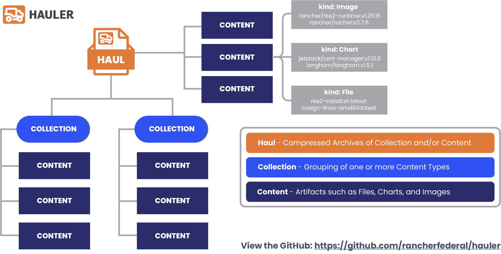
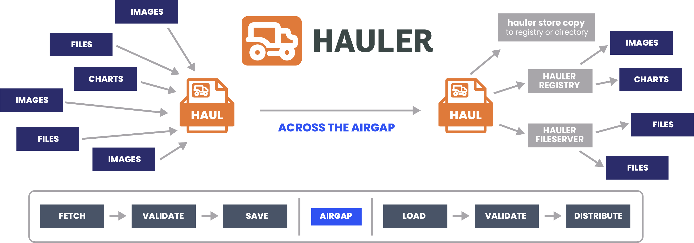

# Simplifying the Airgap Experience with Rancher Government Hauler

### Table of Contents

- [Overview and Introduction](#overview-and-introduction)
- [Rancher Government Hauler](#rancher-government-hauler)
- [Testing out Hauler](#testing-out-hauler)
- [Bootstrapping Utilities](#bootstrapping-utilities)
  - [Embedded Registry](#embedded-registry)
  - [Embedded Fileserver](#embedded-fileserver)
  - [Existing Infrastructure?](#existing-infrastructure)
- [What is Next?](#what-is-next)

## Overview and Introduction

In today's highly connected world, we sometimes forget that there are many instances, especially in the government, where environments need to be intentionally isolated from external connectivity, creating what is known as an air-gapped or disconnected environment. In some cases, these environments may have external connectivity, but that connectivity is extremely unreliable or is limited in its communication, creating what is known as a denied, disrupted, intermittent, and limited impact environment.

After working in these types of environments for years, most teams spent a significant amount of time developing custom code or scripts for moving artifacts between these environments. Unfortunately, this is never an easy process and extremely time-consuming. Here at Rancher Government, we are very familiar with the need to improve the process of working in these environments and recently released a tool that is purpose-built to simplify the airgap experience.

## Rancher Government Hauler

**Hauler** simplifies the airgap experience by providing a straightforward approach that doesn't require operators to adhere to a specific workflow. It is designed as a standalone binary with zero dependencies. **Hauler** represents assets as artifacts and supports container images, helm charts, and files. Additionally, **Hauler** groups these artifacts into **content** and **collections**, allowing operators to easily fetch, store, package, and distribute these assets using declarative manifests or through the command line.

**Hauler** achieves this by storing its **content** and **collections** as *OCI Compliant Artifacts* and even provides bootstrapping utilities such as an embedded registry and embedded fileserver.

To better understand the core concepts of Hauler and how they fit together, let's take a look at the diagram below:



Now that you've been introduced to the core concepts and basics of **Hauler**, let's take a look at the typical air-gapped or disconnected workflow used when working with **Hauler**:



## Testing out Hauler

As we briefly mentioned earlier, **Hauler** *has zero dependencies*, besides itself, so we don't have any prerequisites besides two servers to simulate our air-gapped environment.

Let's designate one server as the **connected server** and one server as the **disconnected server**. For me, you will notice I'm the root user on my `connected-server` and my `disconnected-server`.

Let's start by **downloading and installing Hauler!** As you can see, there is an easy-to-use installation script!

```bash
# sudo to root
[rocky@connected-server hauler] sudo su

# install latest release
[root@connected-server hauler] curl -sfL https://get.hauler.dev | bash

[INFO] Hauler: Starting Installation...
- Version: v1.0.0
- Platform: linux
- Architecture: amd64

[INFO] Hauler: Starting Checksum Verification...
- Expected Checksum: 966fc0fedbc445447f261ecfd03e145b615e764303f7ab685a5e42300beae36b
- Determined Checksum: 966fc0fedbc445447f261ecfd03e145b615e764303f7ab685a5e42300beae36b
- Successfully Verified Checksum: hauler_1.0.0_linux_amd64.tar.gz

[INFO] Hauler: Successfully Installed at /usr/local/bin/hauler
- Hauler v1.0.0 is now available for use!
- Documentation: https://hauler.dev
```

---

Once we have successfully installed it, let's take a look at all the available commands:

```bash
[root@connected-server hauler] hauler --help
Airgap Swiss Army Knife

Usage:
  hauler [flags]
  hauler [command]

Available Commands:
  completion  Generates completion scripts for various shells
  download    Download OCI content from a registry and populate it on disk
  help        Help about any command
  login       Log in to a registry
  serve       Run one or more of hauler's embedded servers types
  store       Interact with hauler's embedded content store
  version     Print the current version

Flags:
  -h, --help               help for hauler
  -l, --log-level string    (default "info")

Use "hauler [command] --help" for more information about a command.
```

---

Feel free to continue exploring the command line, but we're going to move onto adding some artifacts to our `store`. We haven't mentioned it yet, but **Hauler** uses `stores` to logically separate artifacts into directories and the default name is `store`.

We're going to stick with using the command line for today, but if you would like to see an example of adding these same artifacts to the `store` using a manifest, feel free to view it below!

Let's run the following commands below:

```bash
# add a image... defaults to latest and docker.io
[root@connected-server hauler] hauler store add image neuvector/scanner
3:31PM INF added 'image' to store at [index.docker.io/neuvector/scanner:latest]

# add a image with a specific platform and with supply chain artifacts
# may not work for all users due to the specified registry
[root@connected-server hauler] hauler store add image rgcrprod.azurecr.us/longhornio/longhorn-ui:v1.6.0 --platform linux/amd64 --key carbide-key.pub
3:32PM INF signature verified for image [rgcrprod.azurecr.us/longhornio/longhorn-ui:v1.6.0]
3:32PM INF added 'image' to store at [rgcrprod.azurecr.us/longhornio/longhorn-ui:v1.6.0]

# add a helm chart with a specific version
[root@connected-server hauler] hauler store add chart rancher --repo https://releases.rancher.com/server-charts/stable --version 2.8.2
3:33PM INF added 'chart' to store at [hauler/rancher:2.8.2], with digest [sha256:27e742f51e66e32512509a95523bc9a531ec63f723c730b47685e7678cbc30d3]

# add a file and assign it a new name
[root@connected-server hauler] hauler store add file https://get.rke2.io --name install.sh
3:34PM INF added 'file' to store at [hauler/get.rke2.io:latest], with digest [sha256:0bffbf5fecf9dda70c112153a6ea90392cc2e67c55fa82cc7bb0679b03ef68e0]
```

---

<details>
<summary><b>Example Hauler Manifest</b></summary>

```bash
cat << EOF >> hauler-manifest.yaml
apiVersion: content.hauler.cattle.io/v1alpha1
kind: Images
metadata:
  name: hauler-content-images-example
spec:
  images:
    - name: neuvector/scanner:latest
    - name: rgcrprod.azurecr.us/longhornio/longhorn-ui:v1.6.0
      key: carbide-key.pub
      platform: linux/amd64
---
apiVersion: content.hauler.cattle.io/v1alpha1
kind: Charts
metadata:
  name: hauler-content-charts-example
spec:
  charts:
    - name: rancher
      repoURL: https://releases.rancher.com/server-charts/stable
      version: 2.8.2
---
apiVersion: content.hauler.cattle.io/v1alpha1
kind: Files
metadata:
  name: hauler-content-files-example
spec:
  files:
    - path: https://get.rke2.io
      name: install.sh
EOF
```

```bash
# fetch the content from hauler manifest
[root@connected-server hauler] hauler store sync --filename hauler-manifest.yaml
3:36PM INF syncing [content.hauler.cattle.io/v1alpha1, Kind=Images] to store
3:36PM INF added 'image' to store at [index.docker.io/neuvector/scanner:latest]
3:36PM INF signature verified for image [rgcrprod.azurecr.us/longhornio/longhorn-ui:v1.6.0]
3:36PM INF added 'image' to store at [rgcrprod.azurecr.us/longhornio/longhorn-ui:v1.6.0]
3:36PM INF syncing [content.hauler.cattle.io/v1alpha1, Kind=Charts] to store
3:36PM INF added 'chart' to store at [hauler/rancher:2.8.2], with digest [sha256:27e742f51e66e32512509a95523bc9a531ec63f723c730b47685e7678cbc30d3]
3:36PM INF syncing [content.hauler.cattle.io/v1alpha1, Kind=Files] to store
3:36PM INF added 'file' to store at [hauler/install.sh:latest], with digest [sha256:0a6317871b81a2fb0afe1369057aa69209c4668f9d359e38e79e7817f2a10107]
```

</details>

---

Once we've added all the above artifacts, we can verify and view all the **content** in our `store` by running the command below:

```bash
# view the content in the local hauler store
[root@connected-server hauler] hauler store info
+-------------------------------+-------+-------------+----------+----------+
| REFERENCE                     | TYPE  | PLATFORM    |  LAYERS  |   SIZE   |
+-------------------------------+-------+-------------+----------+----------+
| hauler/install.sh:latest      | file  | -           |        1 | 24.7 kB  |
| hauler/rancher:2.8.2          | chart | -           |        1 | 15.0 kB  |
| longhornio/longhorn-ui:v1.6.0 | image | linux/amd64 |        6 | 73.2 MB  |
|                               | atts  | -           |        1 | 11.6 kB  |
|                               | sbom  | -           |        1 | 2.5 MB   |
|                               | sigs  | -           |        1 | 258 B    |
| neuvector/scanner:latest      | image | linux/amd64 |        4 | 174.3 MB |
|                               | image | linux/arm64 |        4 | 163.6 MB |
+-------------------------------+-------+-------------+----------+----------+
|                                                        TOTAL   | 465.7 MB |
+-------------------------------+-------+-------------+----------+----------+
```

---

It's that easy! As you can see we have various types of artifacts in our `store` and we are ready to save it as a `haul`, aka the compressed archive or tarball, by running the command below:

```bash
# save and export the content in the local hauler store
[root@connected-server hauler] hauler store save --filename haul.tar.zst
3:40PM INF saved store [store] -> [/opt/hauler/haul.tar.zst]
```

Now that we have our `haul`, we need to move it to the `disconnected-server`. I'm going to transfer the `haul.tar.zst` to my other server using `scp`.

---

---

---

Once we have the `haul` on the `disconnected-server`, let's run the command below to load the `haul`:

```bash
# load and import the airgapped content to the new local hauler store
[root@disconnected-server hauler] hauler store load --filename haul.tar.zst
3:43PM INF loading content from [haul.tar.zst] to [store]
```

---

Now that we have loaded our `haul`, let's verify and view the **content** in our `store` to ensure it all loaded correctly:

```bash
# view the content in the local hauler store
[root@disconnected-server hauler] hauler store info
+-------------------------------+-------+-------------+----------+----------+
| REFERENCE                     | TYPE  | PLATFORM    |  LAYERS  |   SIZE   |
+-------------------------------+-------+-------------+----------+----------+
| hauler/install.sh:latest      | file  | -           |        1 | 24.7 kB  |
| hauler/rancher:2.8.2          | chart | -           |        1 | 15.0 kB  |
| longhornio/longhorn-ui:v1.6.0 | image | linux/amd64 |        6 | 73.2 MB  |
|                               | atts  | -           |        1 | 11.6 kB  |
|                               | sbom  | -           |        1 | 2.5 MB   |
|                               | sigs  | -           |        1 | 258 B    |
| neuvector/scanner:latest      | image | linux/amd64 |        4 | 174.3 MB |
|                               | image | linux/arm64 |        4 | 163.6 MB |
+-------------------------------+-------+-------------+----------+----------+
|                                                        TOTAL   | 465.7 MB |
+-------------------------------+-------+-------------+----------+----------+
```

As you can see, in a handful of commands, we now have all of the **content** from our `connected-server`, on our `disconnected-server`.

## Bootstrapping Utilities

One more aspect of **Hauler** that really deserves to be highlighted. If you have worked in DevSecOps or Kubernetes or Docker space, you are probably very familiar with the difficult problem of boostrapping your environment(s). Not only does **Hauler** enable you to fetch, package and distribute your artifacts, but it enables you to serve your artifacts out to be used by your infrastructure or applications! I briefly mentioned it earlier, but **Hauler** does this with an embedded registry and embedded fileserver.

Let's head back to our `disconnected-server` and take a look by running the command below:

```bash
[root@disconnected-server hauler] hauler store serve --help
Expose the content of a local store through an OCI compliant registry or file server

Usage:
  hauler store serve [flags]
  hauler store serve [command]

Available Commands:
  fileserver  Serve the file server
  registry    Serve the embedded registry

Flags:
  -h, --help   help for serve

Global Flags:
      --cache string       Location of where to store cache data (defaults to $XDG_CACHE_DIR/hauler)
  -l, --log-level string    (default "info")
  -s, --store string       Location to create store at (default "store")

Use "hauler store serve [command] --help" for more information about a command.
```

### Embedded Registry

Now let's go ahead and server a `registry` by running the command below:

```bash
# serve the content as a registry from the hauler store
# defaults to <FQDN or IP>:5000
[root@disconnected-server hauler] hauler store serve registry
3:49PM INF neuvector/scanner:latest
3:49PM INF longhornio/longhorn-ui:v1.6.0
3:49PM INF hauler/install.sh:latest
3:49PM INF hauler/rancher:2.8.2
3:49PM INF copied artifacts to [127.0.0.1:43273]
3:49PM INF starting registry on port [5000]

WARN[0003] No HTTP secret provided - generated random secret. This may cause problems with uploads if multiple registries are behind a load-balancer. To provide a shared secret, fill in http.secret in the configuration file or set the REGISTRY_HTTP_SECRET environment variable.  go.version=go1.21.7 version=v3.0.0+unknown
INFO[0003] redis not configured                          go.version=go1.21.7 version=v3.0.0+unknown
INFO[0003] Starting upload purge in 38m0s                go.version=go1.21.7 version=v3.0.0+unknown
INFO[0003] using inmemory blob descriptor cache          go.version=go1.21.7 version=v3.0.0+unknown
INFO[0003] listening on [::]:5000                        go.version=go1.21.7 version=v3.0.0+unknown
```

---

Once the `registry` is ready, on the default port of `5000`, we can verify and view the available images with this awesome `curl` command:

```bash
[root@disconnected-server hauler] curl -sfL localhost:5000/v2/_catalog | jq
{
  "repositories": [
    "hauler/install.sh",
    "hauler/rancher",
    "longhornio/longhorn-ui",
    "neuvector/scanner"
  ]
}
```

### Embedded Fileserver

Now let's go ahead and server a `fileserver` by running the command below:

```bash
# serve the file content as a fileserver from the hauler store
# defaults to <FQDN or IP>:8080
[root@disconnected-server hauler] hauler store serve fileserver
3:52PM INF copied artifacts to [store-files]
3:52PM INF starting file server on port [8080]
```

---

Once the `fileserver` is ready, on the default port of `8080`, we can verify and view the available files with a `curl` command:

```bash
[root@disconnected-server hauler] curl -sfL http://localhost:8080
<pre>
<a href="install.sh">install.sh</a>
<a href="rancher-2.8.2.tgz">rancher-2.8.2.tgz</a>
</pre>
```

### Existing Infrastructure?

What if you already have a `registry` or `fileserver` on your airgapped or disconnect environment? Well! **Hauler** does not have to server out a `registry` or `fileserver`. Instead we can use `Hauler` to copy the artifacts in our `store` to our `registry` or `fileserver`.

---

Let's copy the artifacts to an exiting `registry` by running the command below:

```bash
# copy the content to a registry from the hauler store
# copies oci compliant artifacts
[root@disconnected-server hauler] hauler store copy registry://localhost:5000
3:55PM INF hauler/install.sh:latest
3:55PM INF longhornio/longhorn-ui:v1.6.0
3:55PM INF hauler/rancher:2.8.2
3:55PM INF neuvector/scanner:latest
3:55PM INF longhornio/longhorn-ui:v1.6.0
3:55PM INF copied artifacts to [localhost:5000]
```

---

Let's copy the artifacts to an exiting `fileserver` by running the command below:

```bash
# copy the content to a directory from the hauler store
# copies non oci compliant artifacts
[root@disconnected-server hauler] hauler store copy dir://hauler-files
3:57PM INF copied artifacts to [hauler-files]
```

## What is Next?

Congratulations! You made it!! Hopefully, you realize how **Hauler** would be able to simplify and streamline your existing processes for fetching, packaging, validating, and distributing artfacts to airgapped, disconnected, or denied, disrupted, intermittent, and limited impact environments.

To learn more, please visit the [Hauler GitHub Repository](https://github.com/rancherfederal/hauler) or check out the [Official Documentation for Hauler](https://hauler.dev). For any questions or to get in touch with me, please send me an email at [zack.brady@ranchergovernment.com](mailto:zack.brady@ranchergovernment.com), connect with me on Linkedin ([@zackbradys](https://linkedin.com/in/zackbradys)), or follow me on Github ([@zackbradys](https://github.com/zackbradys))!
